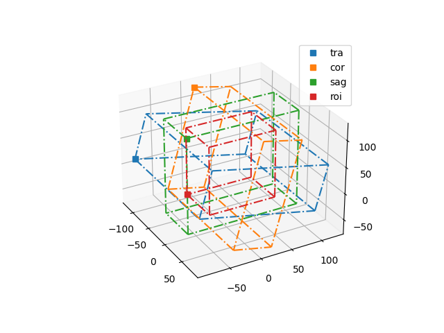
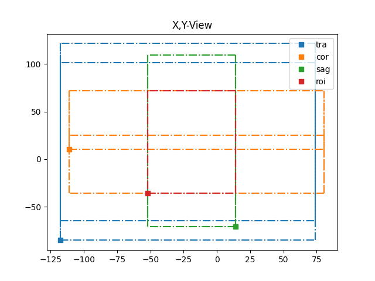
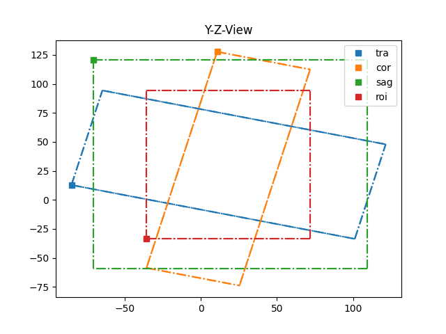
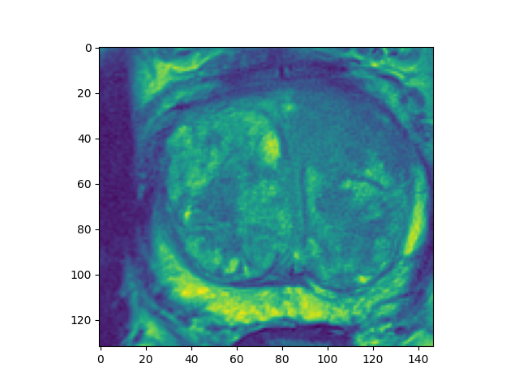
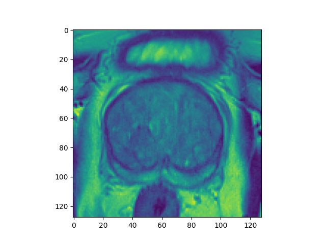
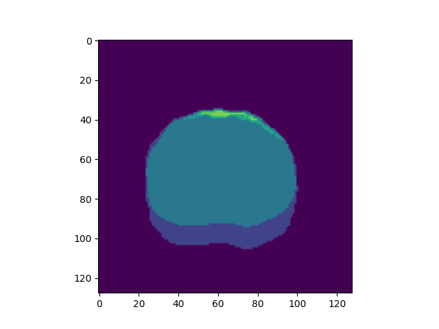
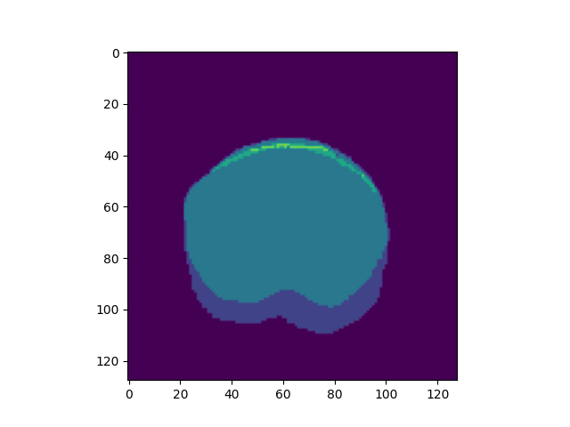

# Day 13 Medical-Image Segmentation
Medical applications are among the most exciting use cases of image segmentation networks.
In this exercise, you will study the publication 
["Towards Patient-Individual PI-RADS v2 Sector Map:
CNN for Automatic Segmentation of Prostatic Zones
from T2-Weighted MRI"](https://www.var.ovgu.de/pub/2019_Meyer_ISBI_Zone_Segmentation.pdf)
by Meyer et al.


1. To get started run

```bash
python ./data/download.py
```

in your terminal. The script will download and prepare the medical scans and domain-expert
annotations for you.

Data loading and resampling work already. 

1. #### Find the bounding box roi as described below by finishing the `compute_roi` function.
Once you have obtained the train and test data, you must create a preprocessing pipeline.
Proceed to `src/util.py` and compute the so called region of interest.
Meyer et al. define this region as:

"The images were acquired by two different
types of Siemens 3T MRI scanners (MAGNETOM Trio and Skyra)
with a body coil. The ground truth segmentation of the prostate
zones was created on the axial images with 3D Slicer [19] by a medical
student and subsequently corrected by an expert urologist. All
volumes were resampled to a spacing of 0.5 × 0.5 × 3 mm which
corresponds to the highest in-plane resolution and maintains the rela-
tion of in-plane to inter-plane resolution of the dataset. A bounding
box ROI of the prostate was automatically extracted with help of
sagittal and coronal T2w series: the ROI was defined as the intersecting
volume of the three MR sequences."

See wikipedia's [anatomical plane](https://en.wikipedia.org/wiki/Anatomical_plane) article for a description of the terminology.
The plots below depict the situation for the 0004 scans:





After computing the intersection of all tensors, we can consider i.e. slice 12 of the 
transversal scan:



Your implementation needs to translate the array indices from local into global coordinate systems and back.
In other words, we require a rotation and translation, or more formally

$$ \mathbf{R}\mathbf{x} + \mathbf{o} = \mathbf{g} .$$

With a rotation matrix $\mathbf{R} \in \mathbb{R}^{3,3}$, the local coordinate vector $\mathbf{x \in \mathbb{R}^{3}}$, the offset $\mathbf{o} \in \mathbb{R}^{3}$, and the global coordinate line $\mathbf{g}$.
Evaluate this transform for every coordinate box line. Use the `box_lines` function from the
`util.py` module to generate a bounding box at the origin. All points in every line must be transformed using the above relationship.

The region of interest is the overlap of all boxes in the global coordinate system. Use [np.amin](https://numpy.org/doc/stable/reference/generated/numpy.amin.html) and [np.amax](https://numpy.org/doc/stable/reference/generated/numpy.amax.html) to find roi-box points $\mathbf{r} \in \mathbb{R}^{3}$. 

To obtain array indices, transform all box points back into the local system. Or, more formally:

$$ \mathbf{R}^{-1} \mathbf{r} - \mathbf{o} = \mathbf{x}_{\text{roi}} $$

With the inverse of the rotation matrix $\mathbf{R}^{-1}$ use [np.linalg.inv](https://numpy.org/doc/stable/reference/generated/numpy.linalg.inv.html) to compute it. $\mathbf{x}_{\text{roi}} \in \mathbb{R}^{3}$ is a point on the boundary of the local roi-box we seek.
Transform all boundary points.

Using the smallest and largest coordinate values of the roi box in
local coordinates now allows array indexing. Following Meyer et al. we discard all but the axial `t2w` scans.

Test your implementation by setting the if-condition wrapping the plotting utility in `compute_roi` to `True` and running vscode pytest `test_roi`. Remember to set it back to `False` afterwards.

2. #### Implement the UNet. 

Navigate to the `train.py` module file in the `src` folder. 
Finish the `UNet3D` class, as discussed in the lecture. 
Use the [flax.linen.Conv](https://flax.readthedocs.io/en/latest/api_reference/flax.linen/_autosummary/flax.linen.Conv.html), [flax.linen.relu](https://flax.readthedocs.io/en/latest/api_reference/flax.linen/_autosummary/flax.linen.activation.relu.html), and [flax.linen.ConvTranspose](https://flax.readthedocs.io/en/latest/api_reference/flax.linen/_autosummary/flax.linen.ConvTranspose.html), to build your model.

3. #### Implement the focal-loss

Open the `util.py` module in `src` and implement the `softmax_focal_loss` function as discussed in the lecture:

$$\mathcal{L}(\mathbf{o},\mathbf{I})=-\mathbf{I}\cdot(1-\sigma_s(\mathbf{o}))^\gamma\cdot\alpha\cdot\ln(\sigma_s(\mathbf{o})) $$

with output logits $\mathbf{o}$, the corresponding labels $\mathbf{I}$ and the softmax function $\sigma_s$.

4. #### Run and test the training script.

Execute the training script with by running `scripts/train.slurm` (locally or using `sbatch`).

After training you can test your model by changing the `checkpoint_name` variable in `src/sample.py` to the desired model checkpoint and running `scripts/test.slurm`.

#### Solution:




5. #### (Optional) Implement mean Intersection-over-Union (mIoU)

Open the `meanIoU.py` in `src` and implement the `compute_iou` function as discussed below.
mIoU is the most common metric used for evaluating semantic segmentation tasks. It can be computed using the values from a confusion matrix as given below

$$\text{mIoU} = \frac{1}{k} \sum_{c=0}^{k}\frac{TP_c}{TP_c+FP_c+FN_c}$$

where `k`, `TP`, `FP`, and `FN` are number of classes, True Positives, False Positives and False Negatives respectively.
The mIoU value generally ranges from 0 to 1 with 0 means no intersection area between predicted segmentation map and ground truth map and 1 means its a perfect fit between these two.
Generally any $\text{mIoU}>0.5$ is considered better.

Run the script with
```bash
python -m src.meanIoU
```

### Acknowledgments:
We thank our course alumni Barbara Wichtmann, for bringing this problem to our attention.
Without her feedback, this code would not exist.

